## Casos de Uso

### Descrição:

- Contas
  - Criação
  - Entrada
  - Alteração
  - Recuperar Senha
  - Exclusão Lógica
  - Visualização

- Perfis
  - Edição
  - Pesquisar
  - Visualização
  - Seguir/Deixar de Seguir

- Postagens (Público)
  - Criação
  - Exclusão
  - Interação
  - Visualização

- Mensagens (Privado)
  - Criação
  - Exclusão
  - Visualização

- Galerias
  - Albuns
- Blogs
- Grupos

### Criação de uma conta no sistema

- Atores:
  - Usuário
  - Sistema

* Pré-Condições:
  - Nenhuma

- Fluxo Básico:
  1. Usuário fornece e-mail, senha e confirmações
  2. Dados do Usuário são validados pelo Sistema
  3. Dados do Usuário são encriptados pelo Sistema
  4. Dados do Usuário são persistidos pelo Sistema
  5. Sistema gera um link com prazo de expiração
  6. Sistema envia e-mail de verificação, com o link, para o Usuário
  7. Usuário confirma o e-mail antes do link expirar
  8. Sistema confirma que o Cadastro do Usuário foi realizado com sucesso
  9. Sistema redireciona o Usuário para a página de Entrada

* Fluxos Alternativos:
  - 2a. E-mail do Usuário é inválido
    2a1. Sistema exibe mensagem de erro
  - 2b. Senha do Usuário não respeita regras de segurança
    - 2b1. Sistema exibe mensagem de erro
  - 3a. Usuário tenta confirmar o e-mail depois de o link expirar
    - 3a1. Sistema sugere que o Usuário realize um novo Cadastro

### Entrada do usuário no sistema

- Atores:
  - Usuário
  - Sistema

- Pré-Condições:
  Usuário deve estar cadastrado

- Fluxo Básico:
  - 1. Usuário fornece e-mail e senha
  - 2.  Sistema autentica o Usuário
  - 3.  Sistema redireciona o Usuário para a página inicial

- Fluxos Alternativos:
  - 2a. Dados do Usuário Inválidos
    - 2a1. Sistema exibe mensagem de erro
  - 3a. Primeio acesso do Usuário
    - 3a1. Sistema redireciona o Usuário para a página de edição de perfil

# Documentação dos Casos de Uso

## Sistema de Gestão para Academia de Alta Performance Esportiva

---

# 1. UC01 – Agendar Treinamento

## 1.1 Identificação

**ID:** UC01  
**Nome:** Agendar Treinamento  
**Atores:** Responsável, Sistema

## 1.2 Objetivo

Permitir que o responsável agende um treinamento para um aluno vinculado à sua conta, selecionando uma turma, data e horário disponíveis.

## 1.3 Pré-condições

- O responsável possui uma conta ativa.
- O responsável está autenticado no sistema.
- Existe pelo menos um aluno cadastrado e vinculado ao responsável.
- Existem turmas cadastradas no sistema.

## 1.4 Fluxo Principal

1. O responsável acessa a opção **Agendar Treinamento**.
2. O sistema apresenta os alunos vinculados ao responsável.
3. O responsável seleciona o aluno.
4. O sistema apresenta as turmas compatíveis com a faixa etária do aluno.
5. O responsável seleciona uma turma.
6. O sistema apresenta as datas e horários disponíveis.
7. O responsável seleciona a data e o horário desejados.
8. O sistema valida a disponibilidade do aluno.
9. O sistema valida a disponibilidade do profissional.
10. O sistema valida a disponibilidade da sala.
11. O sistema verifica a capacidade disponível da turma.
12. O sistema confirma o agendamento.
13. O sistema registra o agendamento com status **"confirmado"**.
14. O sistema reserva a vaga da turma.
15. O sistema notifica o profissional responsável.

## 1.5 Fluxos Alternativos

### FA1 – Turma lotada

1. O sistema identifica que a turma atingiu sua capacidade máxima.
2. O sistema informa ao responsável que não há vagas disponíveis.
3. O sistema sugere outra turma ou horário.
4. Caso aplicável, o sistema permite a entrada do aluno na fila de espera.

### FA2 – Conflito de horário do aluno

1. O sistema identifica que o aluno possui outro agendamento no mesmo horário.
2. O sistema bloqueia o novo agendamento.
3. O sistema informa o conflito ao responsável.
4. O responsável seleciona outro horário.

### FA3 – Profissional indisponível

1. O sistema identifica que o profissional não está disponível no horário selecionado.
2. O sistema bloqueia o agendamento.
3. O sistema informa a indisponibilidade.
4. O responsável seleciona outro horário ou turma.

### FA4 – Sala indisponível

1. O sistema identifica que a sala está indisponível.
2. O sistema bloqueia o agendamento.
3. O sistema informa a indisponibilidade.
4. O responsável seleciona outra opção disponível.

## 1.6 Pós-condições

- O agendamento é registrado.
- O status do agendamento é **"confirmado"**.
- Uma vaga da turma é reservada.
- O profissional responsável é notificado.

## 1.7 Regras de Negócio

- O aluno deve estar dentro da faixa etária aceita.
- A turma não pode ultrapassar sua capacidade máxima.
- O aluno não pode possuir dois agendamentos no mesmo horário.
- Aluno, profissional, sala e turma devem estar disponíveis.
- O sistema deve evitar conflitos em requisições simultâneas.

## 1.8 Relacionamentos

**`<<include>>`**

- Validar Disponibilidade.
- Verificar Capacidade da Turma.

**`<<extend>>`**

- Entrar na Fila de Espera, quando a turma estiver lotada.

## 1.9 Requisitos Relacionados

**RF08, RF09, RF10, RF11, RF20 e RF22.**

---

# 2. UC02 – Cancelar Agendamento

## 2.1 Identificação

**ID:** UC02  
**Nome:** Cancelar Agendamento  
**Atores:** Responsável, Administrador, Sistema

## 2.2 Objetivo

Permitir que um agendamento ativo seja cancelado, respeitando o prazo mínimo definido pela academia.

## 2.3 Pré-condições

- Existe um agendamento ativo.
- O agendamento está vinculado a um aluno do responsável.
- O responsável está autenticado no sistema.

No caso de cancelamento realizado pela administração:

- O administrador deve estar autenticado.
- O cancelamento deve possuir um motivo operacional.

## 2.4 Fluxo Principal

1. O responsável acessa sua agenda.
2. O sistema apresenta os agendamentos ativos.
3. O responsável seleciona o agendamento que deseja cancelar.
4. O sistema verifica se o cancelamento está dentro do prazo permitido.
5. O sistema apresenta a confirmação do cancelamento.
6. O responsável confirma o cancelamento.
7. O sistema altera o status do agendamento para **"cancelado"**.
8. O sistema libera a vaga da turma.
9. O sistema atualiza a disponibilidade da turma.
10. O sistema envia a notificação referente ao cancelamento.

## 2.5 Fluxos Alternativos

### FA1 – Cancelamento fora do prazo

1. O sistema identifica que o cancelamento está fora do prazo mínimo.
2. O sistema bloqueia o cancelamento.
3. O sistema informa ao responsável que o prazo foi ultrapassado.
4. Caso autorizado, a administração pode realizar o cancelamento.

### FA2 – Cancelamento administrativo

1. O administrador acessa o treinamento.
2. O administrador seleciona a opção de cancelar treinamento.
3. O administrador informa o motivo operacional.
4. O sistema cancela o treinamento.
5. O sistema identifica os usuários afetados.
6. O sistema envia as notificações correspondentes.

## 2.6 Pós-condições

- O agendamento possui status **"cancelado"**.
- A vaga da turma é liberada.
- A disponibilidade da turma é atualizada.
- Os usuários afetados são notificados.

## 2.7 Regras de Negócio

- O cancelamento deve respeitar o prazo mínimo definido pela academia.
- O documento de requisitos especifica **8 horas de antecedência** no UC02.
- Fora desse prazo, o cancelamento pode ser bloqueado ou exigir autorização administrativa.
- O cancelamento deve liberar a vaga da turma.

## 2.8 Relacionamentos

**`<<include>>`**

- Verificar Prazo de Cancelamento.
- Liberar Vaga da Turma.

**`<<extend>>`**

- Cancelamento Administrativo, quando aplicável.

## 2.9 Requisitos Relacionados

**RF13, RF14, RF15, RF19 e RF20.**

---

# 3. UC03 – Cadastrar Aluno

## 3.1 Identificação

**ID:** UC03  
**Nome:** Cadastrar Aluno  
**Atores:** Responsável, Sistema

## 3.2 Objetivo

Permitir que o responsável cadastre um ou mais alunos e os vincule à sua conta.

## 3.3 Pré-condições

- O responsável possui uma conta ativa.
- O responsável está autenticado no sistema.

## 3.4 Fluxo Principal

1. O responsável acessa a opção **Cadastrar Aluno**.
2. O sistema apresenta o formulário de cadastro.
3. O responsável informa o nome do aluno.
4. O responsável informa a data de nascimento.
5. O responsável informa os dados de contato.
6. O sistema calcula a idade do aluno.
7. O sistema verifica se a idade está entre **7 e 12 anos**.
8. O responsável confirma o cadastro.
9. O sistema vincula o aluno à conta do responsável.
10. O sistema registra o aluno.
11. O sistema confirma o cadastro.

## 3.5 Fluxos Alternativos

### FA1 – Idade fora da faixa permitida

1. O sistema identifica que o aluno possui idade inferior a 7 anos ou superior a 12 anos.
2. O sistema bloqueia o cadastro.
3. O sistema informa que o aluno está fora da faixa etária aceita pela academia.

## 3.6 Pós-condições

- O aluno é registrado no sistema.
- O aluno fica vinculado ao responsável.
- O aluno pode ser utilizado nos processos de agendamento.

## 3.7 Regras de Negócio

- O aluno deve possuir idade entre **7 e 12 anos**.
- Um responsável pode possuir um ou mais alunos vinculados.
- O sistema deve validar automaticamente a idade.

## 3.8 Relacionamentos

**`<<include>>`**

- Validar Faixa Etária.

## 3.9 Requisitos Relacionados

**RF03 e RF04.**

---

# 4. UC04 – Cadastrar Turma

## 4.1 Identificação

**ID:** UC04  
**Nome:** Cadastrar Turma  
**Atores:** Administrador, Sistema

## 4.2 Objetivo

Permitir que o administrador cadastre uma nova turma, definindo modalidade, faixa etária, capacidade, local, horário e profissional responsável.

## 4.3 Pré-condições

- O administrador possui acesso ao sistema.
- O administrador está autenticado.
- O profissional responsável está cadastrado.
- A sala ou espaço utilizado está cadastrado.

## 4.4 Fluxo Principal

1. O administrador acessa a opção **Cadastrar Turma**.
2. O sistema apresenta o formulário de cadastro.
3. O administrador informa a modalidade.
4. O administrador define a faixa etária mínima e máxima.
5. O administrador informa a capacidade máxima da turma.
6. O administrador seleciona a sala ou espaço.
7. O administrador define o horário.
8. O administrador seleciona o profissional responsável.
9. O sistema valida os dados informados.
10. O sistema verifica a disponibilidade do profissional.
11. O sistema verifica a disponibilidade da sala.
12. O sistema registra a turma.
13. O sistema confirma o cadastro.

## 4.5 Fluxos Alternativos

### FA1 – Profissional indisponível

1. O sistema identifica conflito de horário para o profissional.
2. O sistema impede o cadastro da turma naquele horário.
3. O sistema informa o conflito.
4. O administrador seleciona outro horário ou profissional.

### FA2 – Sala indisponível

1. O sistema identifica que a sala já está ocupada no horário selecionado.
2. O sistema impede o cadastro da turma naquele horário.
3. O sistema informa o conflito.
4. O administrador seleciona outra sala ou horário.

### FA3 – Dados inválidos

1. O sistema identifica informações inválidas.
2. O sistema informa os campos que precisam ser corrigidos.
3. O administrador corrige os dados.
4. O sistema realiza uma nova validação.

## 4.6 Pós-condições

- A turma é cadastrada.
- A turma possui modalidade, faixa etária, capacidade, local, horário e profissional responsável.
- A turma fica disponível para futuros agendamentos.

## 4.7 Regras de Negócio

- A turma deve possuir capacidade máxima definida.
- O profissional deve estar disponível no horário.
- A sala deve estar disponível no horário.
- A configuração da turma deve permitir a validação de compatibilidade com a faixa etária do aluno.
- Não devem existir conflitos de sala ou profissional.

## 4.8 Requisitos Relacionados

**RF07, RF09, RF10, RF16 e RF21.**

---

# 5. UC05 – Registrar Presença e Avaliação

## 5.1 Identificação

**ID:** UC05  
**Nome:** Registrar Presença e Avaliação  
**Atores:** Profissional, Sistema

## 5.2 Objetivo

Permitir que o profissional registre a presença ou ausência do aluno e suas observações de avaliação física e técnica após um treinamento.

## 5.3 Pré-condições

- O profissional está autenticado.
- O profissional possui acesso à turma.
- Existe um treinamento/agendamento correspondente.
- O aluno está vinculado ao treinamento.

## 5.4 Fluxo Principal

1. O profissional acessa sua agenda.
2. O sistema apresenta os treinamentos sob responsabilidade do profissional.
3. O profissional seleciona o treinamento.
4. O sistema apresenta a lista de alunos.
5. O profissional seleciona o aluno.
6. O profissional registra a presença ou ausência.
7. O profissional informa as observações da avaliação.
8. O profissional registra a avaliação física.
9. O profissional registra a avaliação técnica.
10. O sistema valida os dados.
11. O sistema registra as informações do treinamento.
12. O sistema confirma o registro.

## 5.5 Fluxos Alternativos

### FA1 – Aluno ausente

1. O profissional identifica que o aluno não participou do treinamento.
2. O profissional registra a ausência.
3. O sistema salva o registro de ausência.

### FA2 – Dados incompletos

1. O sistema identifica que os dados obrigatórios não foram preenchidos.
2. O sistema informa quais informações precisam ser preenchidas.
3. O profissional complementa os dados.
4. O sistema registra a avaliação.

## 5.6 Pós-condições

- A presença ou ausência do aluno é registrada.
- As observações são armazenadas.
- As avaliações física e técnica são registradas.
- O registro fica associado ao treinamento do aluno.

## 5.7 Regras de Negócio

- O registro deve estar relacionado a um treinamento.
- O profissional é responsável pelo registro de presença e avaliação.
- Os dados registrados podem ser utilizados para acompanhamento da evolução do aluno.

## 5.8 Classes Relacionadas

- `Profissional`
- `Aluno`
- `Agendamento`
- `RegistroTreinamento`

## 5.9 Requisitos Relacionados

**RF16, RF17 e RF18.**

---

# 6. UC06 – Consultar Agenda

## 6.1 Identificação

**ID:** UC06  
**Nome:** Consultar Agenda  
**Atores:** Responsável, Profissional, Sistema

## 6.2 Objetivo

Permitir que usuários autorizados consultem os treinamentos e agendamentos relacionados ao seu perfil.

## 6.3 Pré-condições

- O usuário está autenticado.
- Existem dados de agenda cadastrados no sistema.

## 6.4 Fluxo Principal

### Para o Responsável

1. O responsável acessa a opção **Consultar Agenda**.
2. O sistema identifica os alunos vinculados ao responsável.
3. O sistema apresenta os agendamentos dos dependentes.
4. O responsável seleciona um aluno.
5. O sistema apresenta os treinamentos daquele aluno.
6. O sistema exibe informações como turma, data, horário e status.

### Para o Profissional

1. O profissional acessa a opção **Consultar Agenda**.
2. O sistema identifica as turmas vinculadas ao profissional.
3. O sistema apresenta os treinamentos programados.
4. O sistema permite visualizar a lista de alunos de cada turma.

## 6.5 Fluxos Alternativos

### FA1 – Nenhum agendamento encontrado

1. O sistema identifica que não existem agendamentos para o período consultado.
2. O sistema informa que não foram encontrados treinamentos.

### FA2 – Nenhuma turma encontrada para o profissional

1. O sistema verifica as turmas vinculadas ao profissional.
2. O sistema não encontra turmas.
3. O sistema informa que não existem turmas disponíveis para consulta.

## 6.6 Pós-condições

- O usuário visualiza as informações de sua agenda.
- Nenhum dado é alterado durante a consulta.

## 6.7 Regras de Negócio

- O responsável somente pode consultar a agenda dos alunos vinculados à sua conta.
- O profissional pode consultar sua agenda individual.
- O profissional pode visualizar a lista de alunos das suas turmas.
- O acesso às informações deve respeitar o perfil de acesso do usuário.

## 6.8 Classes Relacionadas

- `Usuario`
- `Responsavel`
- `Profissional`
- `Aluno`
- `Agendamento`
- `Turma`

## 6.9 Requisitos Relacionados

**RF12 e RF16.**

---

# 7. Tabela de Rastreabilidade dos Casos de Uso

| Caso de Uso                               | Funcionalidade Principal          | Atores                              | Requisitos                         |
| ----------------------------------------- | --------------------------------- | ----------------------------------- | ---------------------------------- |
| **UC01 – Agendar Treinamento**            | Agendamento de treinamento        | Responsável, Sistema                | RF08, RF09, RF10, RF11, RF20, RF22 |
| **UC02 – Cancelar Agendamento**           | Cancelamento de agendamento       | Responsável, Administrador, Sistema | RF13, RF14, RF15, RF19, RF20       |
| **UC03 – Cadastrar Aluno**                | Cadastro de dependentes           | Responsável, Sistema                | RF03, RF04                         |
| **UC04 – Cadastrar Turma**                | Cadastro e configuração de turmas | Administrador, Sistema              | RF07, RF09, RF10, RF16, RF21       |
| **UC05 – Registrar Presença e Avaliação** | Registro do treinamento           | Profissional, Sistema               | RF16, RF17, RF18                   |
| **UC06 – Consultar Agenda**               | Consulta de treinamentos          | Responsável, Profissional, Sistema  | RF12, RF16                         |

---

# 8. Relações entre os Casos de Uso

## UC01 – Agendar Treinamento

`Agendar Treinamento`  
→ `<<include>>` **Validar Disponibilidade**  
→ `<<include>>` **Verificar Capacidade da Turma**  
→ `<<extend>>` **Entrar na Fila de Espera**

## UC02 – Cancelar Agendamento

`Cancelar Agendamento`  
→ `<<include>>` **Verificar Prazo de Cancelamento**  
→ `<<include>>` **Liberar Vaga da Turma**

## UC03 – Cadastrar Aluno

`Cadastrar Aluno`  
→ `<<include>>` **Validar Faixa Etária**

## UC01, UC02 e UC19

As operações de criação, alteração e cancelamento de agendamentos podem gerar **Notificações**, conforme o RF20.

---

# 9. Resumo dos Atores

## Responsável

Responsável por:

- Criar e acessar sua conta;
- Cadastrar alunos;
- Agendar treinamentos;
- Cancelar agendamentos;
- Consultar a agenda dos dependentes;
- Consultar a evolução dos alunos;
- Participar da fila de espera quando aplicável.

## Profissional

Responsável por:

- Consultar sua agenda;
- Consultar as turmas;
- Visualizar os alunos;
- Registrar presença;
- Registrar ausência;
- Registrar avaliações físicas e técnicas.

## Administrador

Responsável por:

- Cadastrar profissionais;
- Cadastrar salas;
- Cadastrar turmas;
- Gerenciar treinamentos;
- Realizar cancelamentos operacionais;
- Consultar dashboard;
- Consultar relatórios.

# Diagrama de Casos de Uso

```plantuml
@startuml
title Diagrama de Casos de Uso\nSistema de Gestão para Academia de Alta Performance Esportiva

'========================
' ATORES
'========================

actor "Responsável" as Responsavel
actor "Profissional" as Profissional
actor "Administrador" as Administrador
actor "Sistema" as Sistema

'========================
' SISTEMA
'========================

rectangle "Sistema de Gestão para Academia de Alta Performance Esportiva" {

    '------------------------
    ' Casos de uso do Responsável
    '------------------------

    usecase "Agendar Treinamento" as UC01
    usecase "Cancelar Agendamento" as UC02
    usecase "Cadastrar Aluno" as UC03
    usecase "Consultar Agenda" as UC06R
    usecase "Entrar na Fila de Espera" as Fila
    usecase "Consultar Evolução do Aluno" as Evolucao

    '------------------------
    ' Casos de uso do Profissional
    '------------------------

    usecase "Registrar Presença\ne Avaliação" as UC05
    usecase "Consultar Agenda" as UC06P
    usecase "Visualizar Alunos da Turma" as VisualizarAlunos

    '------------------------
    ' Casos de uso do Administrador
    '------------------------

    usecase "Cadastrar Turma" as UC04
    usecase "Cadastrar Profissionais" as CadProf
    usecase "Cadastrar Salas" as CadSalas
    usecase "Cancelar Treinamento\nAdministrativamente" as CancelAdm
    usecase "Consultar Dashboard" as Dashboard
    usecase "Consultar Relatórios" as Relatorios

    '------------------------
    ' Casos de uso incluídos
    '------------------------

    usecase "Validar Disponibilidade" as ValidarDisp
    usecase "Verificar Capacidade\nda Turma" as VerificarCap
    usecase "Verificar Prazo\nde Cancelamento" as VerificarPrazo
    usecase "Liberar Vaga\nda Turma" as LiberarVaga
    usecase "Validar Faixa Etária" as ValidarIdade
    usecase "Enviar Notificação" as Notificacao
}

'========================
' ASSOCIAÇÕES DOS ATORES
'========================

Responsavel --> UC01
Responsavel --> UC02
Responsavel --> UC03
Responsavel --> UC06R
Responsavel --> Evolucao

Profissional --> UC05
Profissional --> UC06P
Profissional --> VisualizarAlunos

Administrador --> UC04
Administrador --> CadProf
Administrador --> CadSalas
Administrador --> CancelAdm
Administrador --> Dashboard
Administrador --> Relatorios

Sistema --> Notificacao

'========================
' RELACIONAMENTOS UC01
'========================

UC01 ..> ValidarDisp : <<include>>
UC01 ..> VerificarCap : <<include>>
UC01 ..> Fila : <<extend>>
UC01 ..> Notificacao : <<include>>

'========================
' RELACIONAMENTOS UC02
'========================

UC02 ..> VerificarPrazo : <<include>>
UC02 ..> LiberarVaga : <<include>>
UC02 ..> Notificacao : <<include>>

CancelAdm ..> Notificacao : <<include>>

'========================
' RELACIONAMENTOS UC03
'========================

UC03 ..> ValidarIdade : <<include>>

'========================
' RELACIONAMENTOS UC04
'========================

UC04 ..> ValidarDisp : <<include>>

'========================
' RELACIONAMENTOS UC06
'========================

UC06P ..> VisualizarAlunos : <<include>>

@enduml
```

