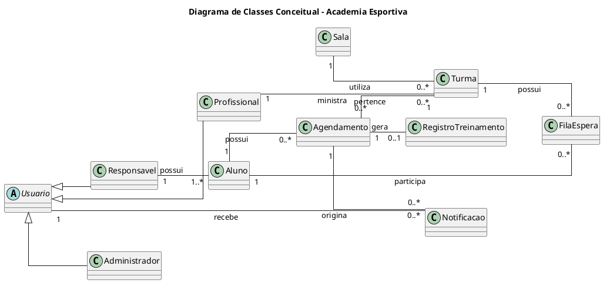
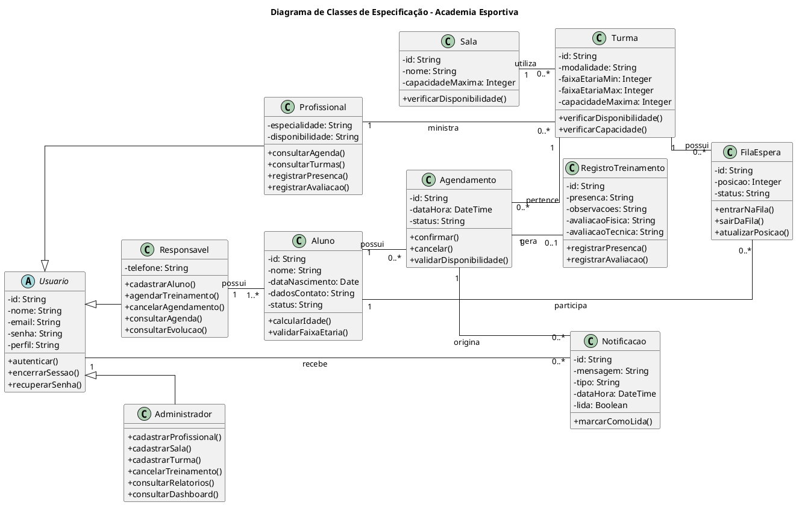

## Diagrama de Classes

### Objetivo

O Diagrama de Classes é uma representação visual das classes, seus atributos, métodos e os relacionamentos entre elas. Ele é fundamental para a modelagem orientada a objetos e serve como base para a implementação do sistema.

### Componentes do Diagrama de Classes

Este documento define um modelo para:

1. **Inserção do Diagrama de Classes Conceitual** (visão de domínio).
2. **Evolução para o Diagrama de Classes de Especificação** (visão de projeto).

Ambos devem ser derivados de:

- Casos de uso;
- Diagrama de casos de uso;
- Documento de levantamento de requisitos;
- Protótipo de baixa fidelidade.

### Fontes de entrada obrigatórias

- **Levantamento de requisitos**: requisitos funcionais e não funcionais.
- **Casos de uso**: atores, fluxos principal e alternativos.
- **Diagrama de casos de uso**: escopo e fronteiras do sistema.
- **Protótipo de baixa fidelidade**: entidades percebidas na interface e regras de navegação.

### 1) Diagrama de Classes Conceitual

#### 1.1 Finalidade

Representar os principais conceitos do domínio da academia de alta performance esportiva, seus perfis de acesso e os relacionamentos envolvidos no cadastro, agendamento e acompanhamento dos treinamentos.

#### 1.2 Escopo

O modelo contempla as principais entidades identificadas nos requisitos, sem incluir componentes técnicos de implementação:

- **Perfis de acesso**: `Usuario`, `Responsavel`, `Profissional` e `Administrador`;
- **Cadastro**: `Aluno` e `Sala`;
- **Agendamento e treinamento**: `Turma`, `Agendamento` e `RegistroTreinamento`;
- **Controle complementar**: `FilaEspera` e `Notificacao`.

O diagrama representa generalização entre `Usuario` e os perfis de acesso, além das multiplicidades das associações. As entidades apresentadas são as principais do problema; portanto, o modelo não pretende representar todas as entidades possíveis do sistema.

#### 1.3 Notação mínima

O código fornecido para o diagrama conceitual define nomes de classes, generalizações, associações, papéis e multiplicidades. Os atributos não foram detalhados na fonte recebida, pois o objetivo desta versão é destacar os conceitos e seus vínculos no domínio.

#### 1.4 Fonte PlantUML

#### 1.5 Descrição das classes e regras de domínio

| Classe                | Descrição e responsabilidade no domínio                                                                                           |
| --------------------- | --------------------------------------------------------------------------------------------------------------------------------- |
| `Usuario`             | Conceito geral de usuário do sistema, especializado pelos perfis de acesso.                                                       |
| `Responsavel`         | Pessoa legalmente responsável por um ou mais alunos; cadastra dependentes, agenda e cancela treinamentos e consulta sua evolução. |
| `Profissional`        | Treinador que ministra turmas, consulta sua agenda e registra presença e avaliações.                                              |
| `Administrador`       | Perfil responsável pela gestão de profissionais, salas, turmas, horários, conflitos e cancelamentos operacionais.                 |
| `Aluno`               | Criança ou atleta entre 7 e 12 anos, vinculada a um responsável e beneficiária dos agendamentos e registros de treinamento.       |
| `Sala`                | Espaço ou campo utilizado por uma turma, sujeito a capacidade e disponibilidade.                                                  |
| `Turma`               | Grupo de treinamento com modalidade, faixa etária, capacidade, sala, horário e profissional responsável.                          |
| `Agendamento`         | Reserva de um treinamento para um aluno em uma turma, com data, horário e status.                                                 |
| `RegistroTreinamento` | Registro associado ao treinamento para presença, ausência e observações de avaliação.                                             |
| `FilaEspera`          | Participação de um aluno na fila de uma turma lotada.                                                                             |
| `Notificacao`         | Comunicação recebida por usuários sobre criação, alteração ou cancelamento de agendamentos.                                       |

Regras de negócio representadas ou derivadas dos requisitos:

- Um `Responsavel` possui um ou mais `Aluno`s (`RF03`, `UC03`), e a idade do aluno deve estar entre 7 e 12 anos (`RF04`).
- Cada `Agendamento` pertence a uma `Turma` e está vinculado a um `Aluno` (`RF08`, `UC01`).
- A turma é ministrada por um `Profissional` e utiliza uma `Sala`; disponibilidade, capacidade e conflitos devem ser validados (`RF05`–`RF11`).
- Um agendamento pode gerar no máximo um `RegistroTreinamento`; a presença e as avaliações são registradas pelo profissional (`RF17`).
- Alunos podem participar da `FilaEspera` de turmas lotadas (`RF10`, `RF22`).
- `Notificacao` é originada por um agendamento e recebida por um usuário (`RF20`).

#### 1.6 Rastreabilidade

| Classe Conceitual     | Requisito(s)                             | Caso(s) de Uso         | Tela/Protótipo                         |
| --------------------- | ---------------------------------------- | ---------------------- | -------------------------------------- |
| `Usuario`             | RF01, RF02, RF20                         | UC01, UC02, UC06       | Seleção do aluno; confirmação          |
| `Responsavel`         | RF01–RF03, RF08, RF12, RF13, RF18        | UC01, UC02, UC03, UC06 | Seleção do aluno; ver agenda           |
| `Profissional`        | RF05, RF07, RF09, RF16, RF17, RF21       | UC04, UC05, UC06       | Confirmação: profissional              |
| `Administrador`       | RF05–RF07, RF15, RF19, RF21              | UC02, UC04, UC06       | Não especificada no protótipo          |
| `Aluno`               | RF03, RF04, RF08, RF11, RF12, RF17, RF18 | UC01, UC03, UC06       | Seleção do aluno                       |
| `Sala`                | RF06, RF09, RF19, RF21                   | UC01, UC04             | Seleção da turma; confirmação          |
| `Turma`               | RF07–RF10, RF16, RF21, RF22              | UC01, UC04, UC06       | Seleção da turma                       |
| `Agendamento`         | RF08–RF15, RF19, RF20                    | UC01, UC02, UC06       | Seleção da turma; confirmação; sucesso |
| `RegistroTreinamento` | RF17, RF18                               | UC05                   | Não especificada no protótipo          |
| `FilaEspera`          | RF10, RF14, RF22                         | UC01                   | Seleção da turma                       |
| `Notificacao`         | RF19, RF20                               | UC01, UC02             | Tela de sucesso                        |

#### 1.7 Critérios de validação

- Todas as classes do diagrama possuem vínculo com requisitos e/ou casos de uso.
- Não foram incluídas classes técnicas, como repositórios ou controladores.
- As associações e multiplicidades foram mantidas conforme o código fornecido.
- O modelo cobre os principais fluxos de cadastro de aluno, agendamento, cancelamento, registro de treinamento, notificações e fila de espera.

### 2) Transição para Diagrama de Classes de Especificação

#### 2.1 Objetivo

Refinar o modelo conceitual para uma estrutura orientada à implementação, preservando as classes, heranças, associações e multiplicidades relevantes para os requisitos.

#### 2.2 Regras de refinamento

O código recebido para a especificação detalha atributos, tipos, visibilidades e operações das classes de domínio. Ele não utiliza estereótipos de `entity`, `service` ou `boundary`, nem introduz interfaces ou classes técnicas, mantendo o escopo nas principais entidades do problema.

O refinamento deverá preservar as validações de idade, capacidade, disponibilidade, conflitos de horário, prazo de cancelamento e controle de acesso por perfil (`RF04`, `RF09`–`RF11`, `RF15` e requisitos não funcionais de segurança e confiabilidade).

#### 2.3 Itens esperados por classe

As classes devem manter responsabilidade, dependências e invariantes alinhadas aos requisitos. Os atributos e operações abaixo são os que constam na fonte recebida; regras de negócio adicionais são documentadas na seção 3.3.

### 3) Diagrama de Classes de Especificação

#### 3.1 Conteúdo mínimo

O diagrama recebido contém as classes de domínio, a generalização de `Usuario`, atributos tipados, operações e associações com multiplicidade. Não contém interfaces, classes de serviço ou de fronteira. Por fidelidade ao material fornecido, o código é reproduzido abaixo sem alterações.

#### 3.2 Fonte PlantUML

#### 3.3 Responsabilidades, restrições e rastreabilidade

As responsabilidades são as mesmas identificadas no modelo conceitual, agora apoiadas pelos atributos e operações presentes na fonte de especificação:

| Classe de Especificação | Origem Conceitual     | Requisito(s)                             | Caso(s) de Uso         |
| ----------------------- | --------------------- | ---------------------------------------- | ---------------------- |
| `Usuario`               | `Usuario`             | RF01, RF02, RF20                         | UC01, UC02, UC06       |
| `Responsavel`           | `Responsavel`         | RF01–RF03, RF08, RF12, RF13, RF18        | UC01, UC02, UC03, UC06 |
| `Profissional`          | `Profissional`        | RF05, RF07, RF16, RF17                   | UC04, UC05, UC06       |
| `Administrador`         | `Administrador`       | RF05–RF07, RF15, RF19, RF21              | UC02, UC04, UC06       |
| `Aluno`                 | `Aluno`               | RF03, RF04, RF08, RF11, RF12, RF17, RF18 | UC01, UC03, UC06       |
| `Sala`                  | `Sala`                | RF06, RF09, RF19, RF21                   | UC01, UC04             |
| `Turma`                 | `Turma`               | RF07–RF10, RF16, RF21, RF22              | UC01, UC04, UC06       |
| `Agendamento`           | `Agendamento`         | RF08–RF15, RF19, RF20                    | UC01, UC02, UC06       |
| `RegistroTreinamento`   | `RegistroTreinamento` | RF17, RF18                               | UC05                   |
| `FilaEspera`            | `FilaEspera`          | RF10, RF14, RF22                         | UC01                   |
| `Notificacao`           | `Notificacao`         | RF19, RF20                               | UC01, UC02             |

Invariantes que deverão ser implementadas na especificação:

- `Aluno` deve possuir idade entre 7 e 12 anos no cadastro (`RF04`).
- `Agendamento` só pode ser confirmado se aluno, profissional, sala e turma estiverem disponíveis (`RF09`).
- A capacidade máxima da `Turma` não pode ser ultrapassada (`RF10`).
- Não pode existir agendamento duplicado para o mesmo aluno no mesmo horário (`RF11`).
- O cancelamento respeita o prazo mínimo de oito horas indicado em `UC02`, salvo autorização administrativa (`RF15`).
- Operações concorrentes não podem alocar a mesma sala, turma ou profissional em conflito, conforme o requisito não funcional de confiabilidade.

#### 3.4 Critérios de qualidade

- Os nomes permanecem alinhados ao domínio e aos requisitos.
- Todas as classes possuem responsabilidade e rastreabilidade identificadas.
- As relações mantêm as multiplicidades do código fornecido.
- A especificação contém atributos, tipos, visibilidades e operações; estereótipos e componentes técnicos não foram incluídos no escopo do código recebido.

### 4) Estrutura de versionamento e revisão

- **Versão**: `v0.1`
- **Data**: `23/09/2026`
- **Autor(es)**: `<Victor Coutinho>`
- **Revisor(es)**: `<Luiz Fernando, Giovanna Sales, Ricardo Costa>`
- **Resumo da alteração**: Documentação dos diagramas conceitual e de especificação, com descrições, regras de domínio e tabelas de rastreabilidade baseadas em `levreq.md`.

### 5) Entregáveis

- Diagrama de Classes Conceitual: fonte PlantUML incluída na seção 1.4.
- Diagrama de Classes de Especificação: fonte PlantUML incluída na seção 3.2.
- Tabelas de rastreabilidade preenchidas nas seções 1.6 e 3.3.
- Registro de validação e pendências documentados nas seções 1.7 e 3.4.

#### Registro de validação

| Item                                   | Situação                                                                 |
| -------------------------------------- | ------------------------------------------------------------------------ |
| Classes principais do domínio          | Validado contra os requisitos e o código fornecido                       |
| Relacionamentos e multiplicidades      | Mantidos conforme os dois diagramas recebidos                            |
| Rastreabilidade                        | Preenchida com requisitos, casos de uso e telas descritas em `levreq.md` |
| Atributos e operações da especificação | Validados contra a fonte PlantUML recebida                               |
| Revisão com equipe e stakeholders      | Pendente de realização                                                   |
