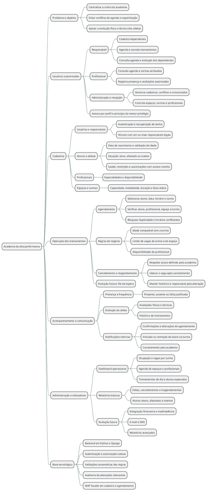

## Introdução

Mapa mental consiste em criar resumos cheios de símbolos, cores, setas e frases de efeito com o objetivo de organizar o conteúdo e facilitar associações entre as informações destacadas. Esse material é muito indicado para pessoas que têm facilidade de aprender de forma visual.

 
## Metodologia

O mapa foi elaborado a partir da consolidação das ideias levantadas no <a href="Brainstorm.md">Brainstorm</a>, no <a href="5w2h.md">5W2H</a> e no <a href="design_thinking.md">Design Thinking</a>. O tema central representa o sistema e seus ramos organizam o problema, os usuários, os cadastros, a operação, o acompanhamento, a administração e a base tecnológica. O diagrama foi escrito em PlantUML para permanecer versionável e fácil de atualizar durante as próximas iterações.

 
## Mapa mental geral
 
### Versão 1.0

O centro do mapa é o **Sistema para academia de alta perfomance**. A leitura parte do centro e segue os ramos para compreender:

- **Problema e objetivo:** por que o sistema é necessário e quais resultados deve apoiar;
- **Usuários e permissões:** quem utiliza a solução e quais informações cada perfil pode acessar;
- **Cadastros:** quais entidades sustentam a operação;
- **Operação dos treinamentos:** como o agendamento, as validações, os cancelamentos e os reagendamentos funcionam;
- **Acompanhamento e comunicação:** como registrar a rotina dos atletas e informar os envolvidos;
- **Administração e indicadores:** como a academia acompanha sua operação;
- **Base tecnológica:** quais decisões orientam o backend e o MVP.

## Conclusão

O mapa organiza a proposta do projeto em uma visão única: a academia precisa de uma fonte confiável para gerenciar responsáveis, atletas, profissionais, espaços e treinamentos. O núcleo do MVP está no vínculo entre responsável e aluno e no agendamento com validação de idade, disponibilidade e vagas. Os demais ramos mostram capacidades que podem ser desenvolvidas de forma incremental.

 
## Referências

- [Brainstorm](Brainstorm.md)
- [5W2H](5w2h.md)
- [Design Thinking](design_thinking.md)
- [Documentação do PlantUML](https://plantuml.com/mindmap-diagram)

## Versionamento

| Data       | Versão | Descrição                                            | Autor(es) |
| ---------- | ------ | ---------------------------------------------------- | --------- |
| 13/09/2026 | 1.0    | Criação do mapa mental geral da proposta do sistema. | Luiz Fernando  |
