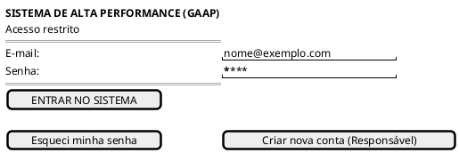
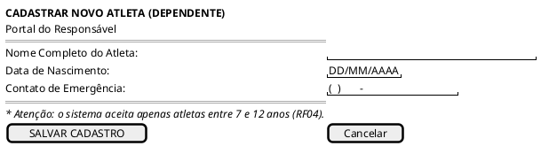
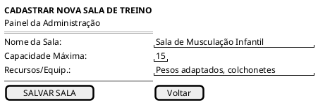
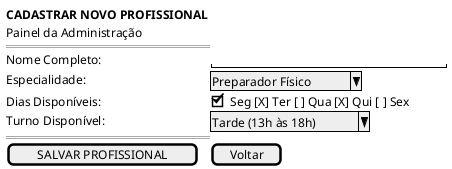
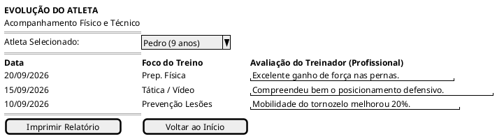
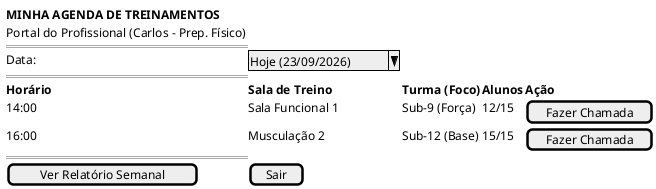
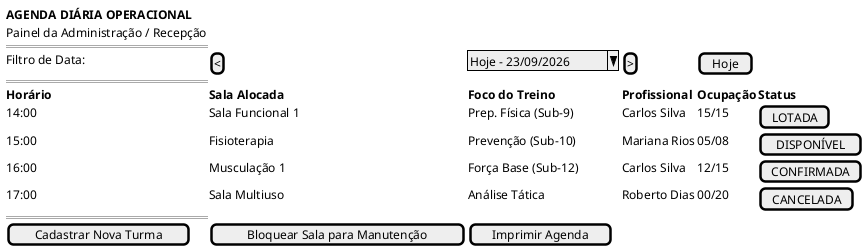
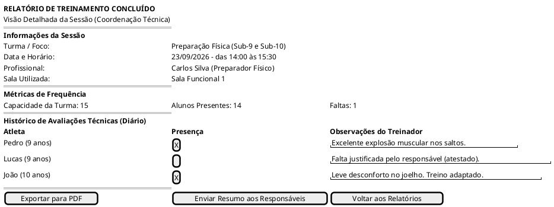

## Introdução

O protótipo de baixa fidelidade representa, de forma rápida e objetiva, as principais interfaces do sistema de gestão da academia de alta performance esportiva. As telas foram elaboradas em PlantUML com a sintaxe Salt, priorizando a organização dos campos, ações e informações necessárias para validar os fluxos antes da implementação visual definitiva.

## Metodologia

As interfaces foram definidas a partir dos requisitos funcionais e casos de uso descritos no documento de levantamento de requisitos. Cada protótipo identifica o perfil que utiliza a tela, os requisitos atendidos e o fluxo principal representado. O conjunto contempla o acesso ao sistema, o cadastro de atletas, a configuração administrativa, a operação dos treinamentos e o acompanhamento da evolução dos alunos.

## Protótipos de baixa fidelidade

### Versão 1.0

## 1. Interface de Login e Acesso

**Perfil:** Responsável, Profissional e Administração 
**Requisito relacionado:** RF02

Esta tela representa a porta de entrada do sistema. Ela permite autenticação, recuperação de senha e criação de conta para o responsável, atendendo ao controle de acesso dos diferentes perfis da aplicação.

**Relação com os requisitos:** atende ao login, logout e recuperação de senha previstos no RF02. A opção de criação de conta também encaminha para o cadastro inicial do responsável, relacionado ao RF01.

## 2. Cadastro de Aluno / Atleta

**Perfil:** Responsável 
**Requisitos relacionados:** RF03, RF04 e UC03

O responsável utiliza esta interface para cadastrar uma criança e vinculá-la à própria conta. Os dados de contato são associados ao responsável legal, e a data de nascimento permite validar a faixa etária aceita pela academia.

**Relação com os requisitos:** atende ao cadastro de um ou mais alunos vinculados ao responsável (RF03) e à validação automática da idade entre 7 e 12 anos (RF04). O fluxo corresponde ao UC03, incluindo o bloqueio do cadastro quando a idade estiver fora da faixa permitida.

## 3. Cadastro de Salas e Profissionais

### 3.1 Cadastro de Sala de Treinamento

**Perfil:** Administrador/Recepção 
**Requisito relacionado:** RF06

Antes de criar turmas e agendar treinamentos, a administração cadastra os espaços disponíveis. A capacidade máxima informada nesta tela será usada posteriormente para evitar superlotação.

**Relação com os requisitos:** atende ao RF06, que exige o cadastro de campos ou espaços com capacidade máxima. Os dados cadastrados apoiam as validações de disponibilidade previstas no RF09 e no requisito não funcional de confiabilidade.

### 3.2 Cadastro de Profissional

**Perfil:** Administrador/Recepção 
**Requisito relacionado:** RF05

Esta interface registra os profissionais que ministrarão os treinamentos, suas especialidades e os períodos em que podem trabalhar. Essas informações serão utilizadas na montagem das turmas e na validação de conflitos de agenda.

**Relação com os requisitos:** atende ao RF05, permitindo cadastrar especialidade e disponibilidade do profissional. A disponibilidade será considerada na validação de agendamentos do RF09 e na prevenção de conflitos descrita nos requisitos não funcionais.

## 4. Consulta da Evolução do Atleta

**Perfil:** Responsável 
**Requisito relacionado:** RF18

O responsável consulta o histórico de avaliações físicas e técnicas registradas pelos profissionais. A tela organiza os registros por data, foco do treinamento e observações, tornando a evolução do atleta compreensível para a família.

**Relação com os requisitos:** atende ao RF18, que permite consultar a evolução física e técnica dos dependentes. Os dados exibidos dependem dos registros de presença e avaliações previstos no RF17, realizados pelo profissional após os treinamentos.

## 5. Agenda e Lista de Alunos do Profissional

**Perfil:** Profissional (Treinador/Preparador) 
**Requisito relacionado:** RF16

O profissional consulta a agenda diária, as salas, as turmas e a quantidade de alunos esperados. A ação “Fazer Chamada” representa o acesso ao registro de presença e às observações do treinamento.

**Relação com os requisitos:** atende ao RF16, permitindo consultar a agenda individual e a lista de alunos de cada turma. A chamada encaminha para o RF17, que contempla o registro de presença, ausência e observações de avaliação.

## 6. Agenda Diária Operacional

**Perfil:** Administrador/Recepção 
**Requisitos relacionados:** RF07, RF19, RF21 e RF22

Esta tela oferece uma visão operacional dos treinamentos do dia. A administração acompanha salas, profissionais, ocupação e status, podendo iniciar o cadastro de turmas, bloquear uma sala ou imprimir a agenda.

**Relação com os requisitos:** a agenda apoia o cadastro e acompanhamento das turmas do RF07, o dashboard operacional do RF21 e o controle de ocupação relacionado ao RF10. O status “CANCELADA” representa o cancelamento administrativo do RF19. A indicação de turma lotada também prepara a evolução para fila de espera do RF22.

## 7. Relatório Completo de Treinamento

**Perfil:** Administração, Recepção e Coordenação Técnica 
**Requisitos relacionados:** RF17, RF18, RF19 e RF20

O relatório consolida os dados da sessão concluída, incluindo turma, sala, profissional, frequência e observações individuais. Ele serve para acompanhamento operacional e para comunicar aos responsáveis informações relevantes sobre o treinamento.

**Relação com os requisitos:** consolida os registros de presença e avaliações do RF17, fornecendo informações que podem ser consultadas pelo responsável conforme o RF18. O envio do resumo representa uma notificação interna relacionada ao RF20, enquanto a visão da sessão auxilia a administração no acompanhamento de cancelamentos e ocorrências do RF19.

## Conclusão

Os protótipos representam os principais fluxos identificados no levantamento de requisitos: autenticação, cadastro de dependentes, configuração da infraestrutura, consulta da agenda, acompanhamento da evolução e consolidação dos treinamentos. Por serem protótipos de baixa fidelidade, as telas concentram-se na hierarquia das informações e nas ações essenciais; detalhes visuais, identidade da marca e validações de interação deverão ser definidos nas próximas versões.

## Referências

- [Levantamento de Requisitos e Caso de Uso](../Elaboracao/levreq.md)
- [Documentação do PlantUML Salt](https://plantuml.com/salt)

## Autor(es)

| Data       | Versão | Descrição                                   | Autor(es) |
| ---------- | ------ | ------------------------------------------- | --------- |
| 23/09/2026 | 1.0    | Criação dos protótipos de baixa fidelidade. | Luiz Fernando   |
